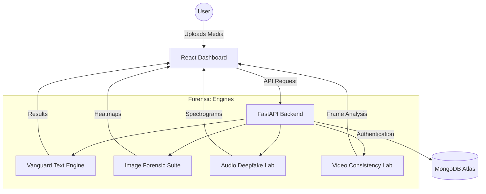
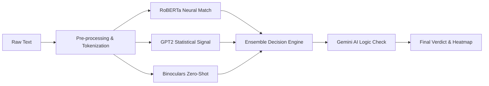
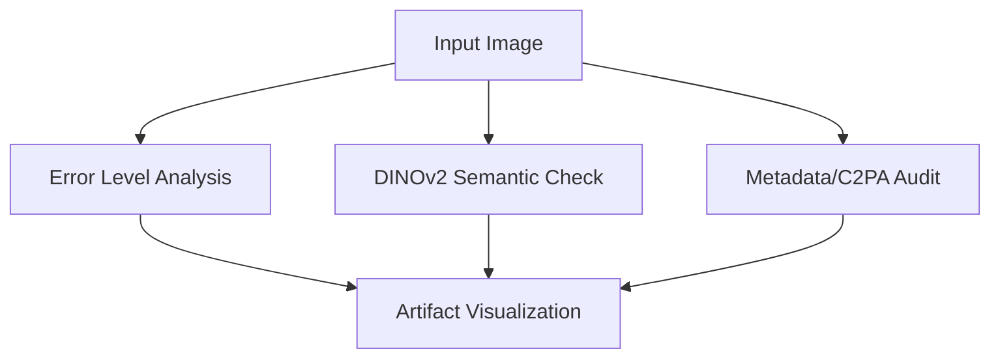
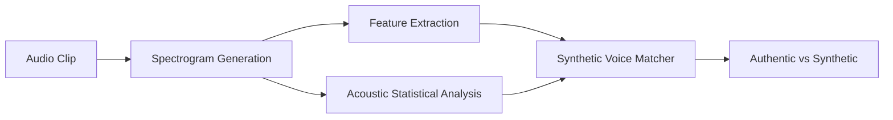
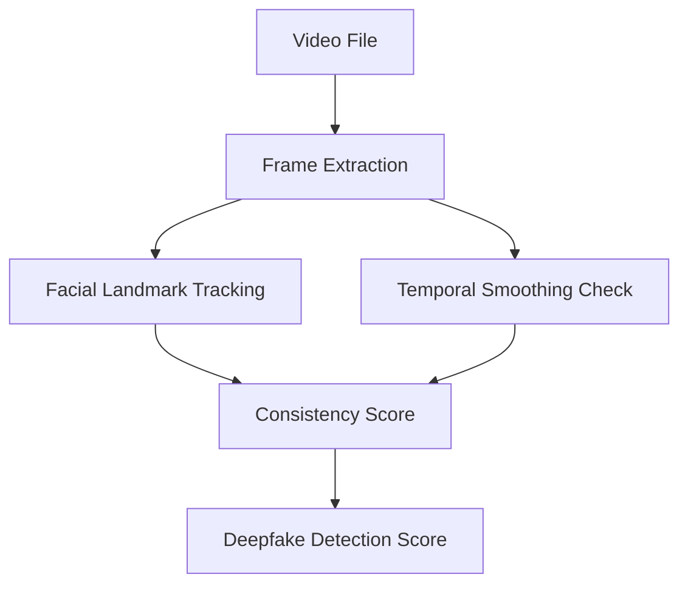

# 🛡️ FakeShield: AI Forensic Laboratory

FakeShield is a state-of-the-art, multi-modal deepfake detection platform designed for researchers, journalists, and security professionals. It leverages advanced machine learning ensembles to detect AI-generated content across **Text, Image, Audio, and Video** with surgical precision.

---

## 🚀 Key Features
- **Multimodal Analysis**: Four dedicated forensic labs for different media types.
- **Explainable AI (XAI)**: Provides sentence-level highlighting and heatmap overlays.
- **Vanguard Engine**: A proprietary ensemble (RoBERTa + GPT2 + Binoculars) for high-accuracy text detection.
- **Real-time Processing**: Fast inference with background warmup for zero-latency analysis.
- **Enterprise Dashboard**: Unified view for history, statistics, and lab management.

---

## 🏗️ System Architecture



---

## 🧪 Forensic Labs in Detail

### 1. Text Forensic Lab (Vanguard v60.0)
The Text Lab uses the **Vanguard Engine**, a 3-layer ensemble designed to bypass "humanized" AI text.

**How it works:**
1.  **Neural Signature**: Uses RoBERTa-HC3 to identify architectural patterns common in LLMs.
2.  **Statistical Signal**: Measures Perplexity and Burstiness using GPT2-Medium to detect "flat" linguistic entropy.
3.  **Zero-Shot Profiling**: Employs **Binoculars** (Observer vs Performer ratio) for high-confidence classification without specific training.



---

### 2. Image Forensic Lab
Analyzes images for manipulated pixels and metadata inconsistencies.

**Forensic Layers:**
- **ELA (Error Level Analysis)**: Identifies different compression levels indicating local edits.
- **DINOv2 Heatmaps**: Uses Vision Transformers to find semantic inconsistencies in textures.
- **PRNU (Photo Response Non-Uniformity)**: Detects "sensor fingerprints" to verify camera authenticity.



---

### 3. Audio Forensic Lab
Detects voice cloning and synthetic speech patterns.

**Forensic Layers:**
- **WavLM Integration**: Analyzes speech representations to find synthetic artifacts.
- **Spectral Variance**: Detects the "robotic" consistency of AI-generated voices.
- **Speaker Consistency**: Verifies if the voice signature remains stable throughout the clip.



---

### 4. Video Forensic Lab
Detects deepfake faces and temporal inconsistencies in video streams.

**Forensic Layers:**
- **Face Consistency**: Checks for frame-to-frame jitter in facial landmarks.
- **Lip-Sync Audit**: Cross-references audio signals with lip movements.
- **Temporal Artifacts**: Identifies "ghosting" or blending issues in video frames.



---

## 🛠️ Technology Stack
- **Frontend**: React 18, Vite, TypeScript, Tailwind CSS, Framer Motion, Lucide Icons.
- **Backend**: FastAPI, Python 3.10, Uvicorn.
- **ML/AI**: PyTorch, Transformers (Hugging Face), Optimum (ONNX), OpenCV, Librosa.
- **Database**: MongoDB Atlas (NoSQL).
- **Deployment**: Vercel (Frontend) & Hugging Face Spaces (Backend).

---

## 📦 Installation & Setup

### Prerequisites
- Python 3.10+
- Node.js 18+
- MongoDB Instance

### Local Development
1. **Clone the Repo**:
   ```bash
   git clone https://github.com/Akash4782/Fakeshield.git
   cd Fakeshield
   ```

2. **Backend Setup**:
   ```bash
   cd backend
   python -m venv .venv
   source .venv/bin/activate # Windows: .venv\Scripts\activate
   pip install -r requirements.txt
   python start_backend.py
   ```

3. **Frontend Setup**:
   ```bash
   cd fakeshield
   npm install
   npm run dev
   ```

---

## 🛡️ License
Distributed under the MIT License. See `LICENSE` for more information.

---

Created with ❤️ by **Akash Virdi** as a Final Year Project.
