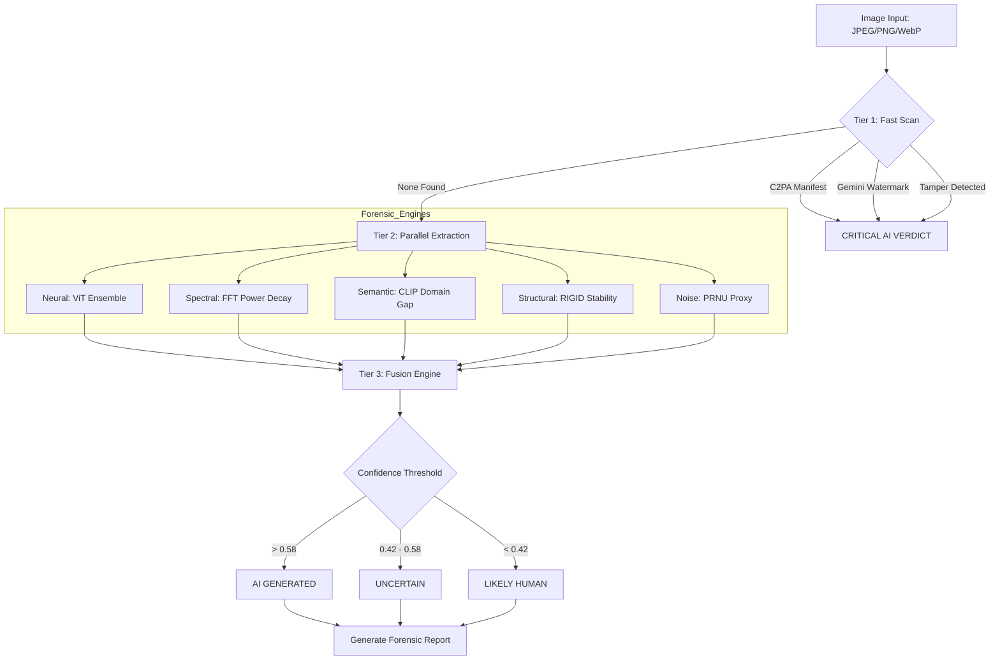

# FakeShield AI Image Lab: Technical Specification & Forensic Architecture

## 1. Executive Overview
The **AI Image Lab** is the flagship image forensic module of the FakeShield ecosystem. It represents a 2026-standard implementation of multi-signal deepfake detection, specifically engineered to counter modern diffusion models (SDXL, Midjourney v7, DALL-E 3) and generative water-filling techniques. Unlike binary classifiers, the Lab utilizes a **Confidence-Weighted Fusion Engine** that evaluates evidence across geometric, semantic, spectral, and textural domains.

---

## 2. Theoretical Architecture: The Multi-Signal Suite

### 2.1 RIGID: Perturbation Invariance Analysis
*   **Backbone:** `facebook/dinov2-base` (Vision Transformer with Self-Supervised Learning).
*   **Theory:** Real-world photographs possess physical "rigidity." When subjected to Gaussian noise, their core structural embeddings remain invariant. AI-generated images, which exist on a highly sensitive latent manifold, exhibit "fragility"—their embeddings collapse or shift significantly under minimal perturbation.
*   **Metric:** The system calculates the Cosine Similarity between the original image and 8 noisy variants. A similarity score $< 0.85$ triggers an AI flag.

### 2.2 Neural Ensemble: Spatial Texture Fingerprinting
*   **Models:** Ensemble of `umm-maybe` (SigLIP-based) and `dima806` (ViT-based) detectors.
*   **Theory:** Generative models leave "spatial fingerprints"—micro-patterns in the arrangement of pixels that differ from the Bayer filter patterns of physical camera sensors. 
*   **Fusion Logic:** The engine weighs SOTA research models to avoid false positives on high-frequency natural textures like sand, fabric, or complex depth-of-field blur.

### 2.3 CLIP Semantic Domain Gap
*   **Strategy:** Zero-shot contrastive analysis using `openai/clip-vit-large-patch14`.
*   **Methodology:** The image is projected into a shared latent space alongside carefully engineered prompt pairs. 
*   **Significance:** This signal catches AI "aesthetics" (e.g., the hyper-realistic smoothness of Midjourney or the lighting inconsistencies of DALL-E) that are chemically identified as "synthetic" by the CLIP transformer.

### 2.4 Spectral Forensics: FFT Power Decay
*   **Math:** 2D Fast Fourier Transform (FFT) + Radial Integral Operation (RIO).
*   **Discovery:** Natural photography follows a power-law decay ($1/f^2$). GANs and Diffusion models introduce high-frequency "plateaus" due to upsampling artifacts and grid-based generation.
*   **Diagnostic:** A deviation in the spectral slope ($\alpha$) from the natural $-2.3$ characteristic is a definitive forensic marker.

### 2.5 PRNU & Noise Residue
*   **Basis:** Noiseprint + Photo Response Non-Uniformity (PRNU) proxies.
*   **Process:** Median filter residuals isolate the sensor noise. Real cameras show structured noise (fixed-pattern noise); AI images show isotropic (uniform) noise.
*   **Metrics:** Analysis of Noise Kurtosis and Isotropy.

---

## 3. The "Hard Veto" Short-Circuit Pipeline

FakeShield employs a tiered verification system to ensure maximum recall while maintaining zero-latency for known signatures.

### Tier 1: C2PA Content Credentials
*   **Protocol:** CAI (Content Authenticity Initiative).
*   **Action:** If a cryptographic manifest is present (e.g., from DALL-E 3 or Firefly) declaring the image as "GenAI," the analysis exits immediately with a **Critical AI Verdict**.

### Tier 2: Gemini Watermark Engine
*   **Target:** Google Gemini (Imagen) 4-pointed sparkle.
*   **Algorithm:** Dual-stage template matching combined with geometric verification. 
*   **Vetoes:** Includes a "Saturation Veto" (to ignore bright fabric) and "Point Check" (ensuring the tips of the astroid are distinct).

### Tier 3: Tampering/Removal Detection
*   **Concept:** "The Absence of Evidence is Evidence."
*   **Logic:** Detecting "Heal" or "Inpaint" anomalies in the bottom-right corner where watermarks are typically located. If a user deletes a watermark, FakeShield identifies the local variance delta and flags the image as AI-generated.

---

## 4. Forensic Workflow & Fusion Engine

### 4.1 Pre-processing
*   Standardization to RGB space.
*   Application of Hann windows for spectral stability.
*   High-pass filtering for noise isolation.

### 4.2 Parallel Inference
All non-veto signals (RIGID, Neural, CLIP, FFT, Noise, ELA) run in a `ThreadPoolExecutor`. This reduces total forensic latency to $< 2.5$ seconds for high-resolution assets.

### 4.3 Fusion Logic (v2026 Calibration)
The final probability is calculated as:
$$P_{final} = \frac{\sum (Score_i \times Power_{i})}{\sum Power_{i}}$$
Where $Power_i$ is a dynamic factor derived from the signal's weight and real-time confidence (e.g., a low-quality JPEG downweights the FFT signal).

---

## 5. Visual Forensic Capabilities
The AI Image Lab goes beyond a simple probability, providing tools for human-in-the-loop verification:
- **Heatmap Overlay:** JET-mapped noise residuals highlighting manipulation zones.
- **ELA Viewer:** Error Level Analysis emphasizing re-compression deltas.
- **Spectrum Map:** Magma-mapped 2D FFT highlighting upsampling artifacts.
- **Forensic Lens:** Depth-of-field and metadata inspector.

---

## 6. Logic Flowchart: Adaptive Forensic Pipeline

---
> [!IMPORTANT]
> **FakeShield AI Image Lab** is designed for forensic-grade applications. It provides a detailed traceability report for every verdict, ensuring that automated scores are backed by clinical evidence.

