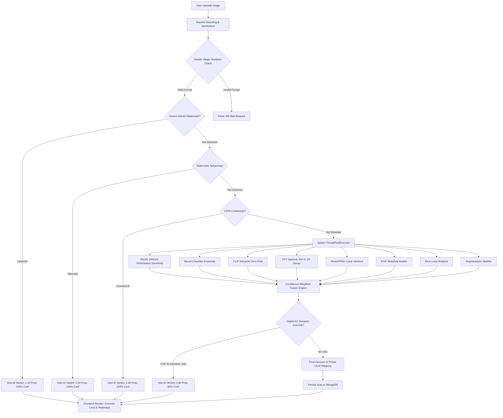

# 🛡️ FakeShield: AI Image Forensic Laboratory Documentation
## Research-Backed Multi-Signal Analysis & Forensic Engine (v8.0)

This documentation provides an exhaustive, research-backed breakdown of the **AI Image Forensic Laboratory** implemented in **FakeShield**. The engine integrates structural, semantic, spectral, and cryptographic verification signals to identify AI-generated or manipulated imagery.

---

## 📌 Executive Summary
The FakeShield Image Lab is built upon a **hybrid forensic pipeline** that balances deep-learning semantic classifiers with classical digital image forensics. Instead of relying on a single, easily fooled neural network, FakeShield extracts **eight independent signals** and processes them through a **confidence-weighted fusion engine**. 

Furthermore, the system implements **cryptographic verification (C2PA)** and **geometric watermark checks** to immediately short-circuit computation for known generators, providing 100% reliable detection for watermarked models like Google Gemini and Adobe Firefly.

---

## 🏗️ Core Architecture & System Workflow

The image forensic process runs asynchronously and utilizes a thread pool to avoid blocking the main server loop. The system flows through several stages:

---

## 🧪 Forensic Signals: Deep Dive

### 1. RIGID (DINOv2 Perturbation Sensitivity)
* **Underlying Model:** `facebook/dinov2-base` (Vision Transformer, ViT)
* **Base Weight:** 0.35 (Standardized to 0.28 in fusion)
* **Theory:** Real images are stable under minor noise perturbations, retaining their location in the semantic embedding space. In contrast, AI-generated images lie on a narrow manifold and exhibit high sensitivity to noise, causing their embeddings to shift.
* **Mechanism:**
  1. The engine prepares a batch containing the original image and $N$ perturbed copies (Gaussian noise added, $\sigma = 0.05$).
  2. The batch is passed through DINOv2 to extract CLS token embeddings.
  3. The Cosine Similarity ($S$) between the original embedding and the noisy embeddings is calculated:
     $$\text{similarity} = \frac{1}{N} \sum_{i=1}^{N} \text{CosineSimilarity}(E_{\text{orig}}, E_{\text{noise}_i})$$
  4. The AI probability is derived by mapping the mean similarity:
     $$P_{\text{AI}} = \text{clip}\left(\frac{0.95 - S_{\text{mean}}}{0.25}, 0.0, 1.0\right)$$
  5. The confidence value is determined by the deviation from a stable threshold:
     $$\text{Confidence} = \text{clip}\left(\frac{|S_{\text{mean}} - 0.875|}{0.075}, 0.0, 1.0\right)$$

### 2. C2PA Content Credentials
* **Underlying Engine:** `c2pa-python` SDK
* **Base Weight:** 1.00 (Hard Short-Circuit)
* **Theory:** Standardized by the Content Authenticity Initiative (CAI), C2PA binds cryptographic claims of provenance directly into the asset's metadata. 
* **Mechanism:**
  - Scans JPEG, PNG, and WebP files for a C2PA manifest.
  - Extracts the `active_manifest`, parsing assertions like `c2pa.genai` or checking the `claim_generator` string for known AI entities (e.g., `openai`, `dall-e`, `adobe firefly`, `midjourney`).
  - If a generative AI assertion or known signature is found, the system immediately returns a **Definitive AI Verdict (1.00 probability, 100% confidence)**.

### 3. Neural Classifier Ensemble
* **Underlying Models:** 
  - Primary: `umm-maybe/AI-image-detector` (SigLIP-backed ViT)
  - Backup: `dima806/deepfake_vs_real_image_detection` (ViT)
* **Base Weight:** 0.25 (Enforced as 0.35 in final fusion)
* **Theory:** Supervised ViT classifiers trained on large corpuses of real vs synthetic images excel at detecting high-frequency spatial artifacts left by diffusion and GAN generators.
* **Mechanism:**
  - Employs a thread-safe synchronizer lock (`MODEL_LOAD_LOCK`) to load both models into GPU/CPU memory.
  - Computes Softmax probabilities over target AI classes.
  - Computes an ensemble score:
     $$S_{\text{ensemble}} = \text{Mean}(S_{\text{Primary}}, S_{\text{Backup}})$$
  - Confidence is dynamically scaled: high agreement yields high confidence (up to 0.90), while disagreement penalizes the confidence down to a minimum floor of 0.30.

### 4. CLIP Semantic Zero-Shot Profiling
* **Underlying Model:** `openai/clip-vit-large-patch14` (with `clip-vit-base-patch32` fallback)
* **Base Weight:** 0.12 (Standardized to 0.07 in fusion)
* **Theory:** Visual-textual alignment models capture high-level semantic domain differences. AI images often possess an "uncanny" style, flat rendering properties, or lighting profiles that resemble generated templates.
* **Mechanism:**
  - Contrastively compares the image against two engineered prompt groups:
    - **Real Photo Prompts:** *"a real photograph taken with a camera"*, *"a genuine photo with natural lighting"*...
    - **AI Prompts:** *"an image generated by artificial intelligence"*, *"a synthetic digital image with smooth textures"*...
  - Normalizes the soft probabilities across both prompt sets to obtain a zero-shot semantic score.

### 5. FFT Spectral Analysis
* **Mathematical Basis:** SPAI & RIO (Radial Integral Operation)
* **Base Weight:** 0.03
* **Theory:** Natural camera lenses produce high-frequency details that decay according to a power law ($1/f^\alpha$ where $\alpha \approx 2.0 - 3.0$). AI generation pipelines (GANs, Up-samplers) leave periodic, checkerboard, or grid-like high-frequency spikes.
* **Mechanism:**
  - Converts the image to grayscale and resizes it to $512 \times 512$.
  - Applies a 2D Hann window to suppress spectral leakage:
    $$W(x,y) = \text{hanning}(x) \otimes \text{hanning}(y)$$
  - Computes the 2D Fast Fourier Transform ($F$) and shifts the low frequencies to the center.
  - Calculates the Power Spectral Density:
    $$\text{PSD} = |F(u,v)|^2$$
  - Measures the radial average to calculate slope alpha:
    - AI images display a flatter decay (too much high-frequency noise, $\alpha < 1.5$) or periodic peaks.
  - Outputs a base64 MAGMA colormap spectrogram with overlay rings representing the radial integral bands for visual analysis.

### 6. Noise & PRNU Fingerprint (Wiener Filter Proxy)
* **Base Weight:** 0.05
* **Theory:** Real camera sensors leave a unique, deterministic hardware noise pattern known as Photo Response Non-Uniformity (PRNU), which is spatially heterogeneous. AI images feature isotropic (uniform in all directions) synthetic noise.
* **Mechanism:**
  - Applies a local Median Filter as a predictor to extract the high-pass noise residual:
    $$R(x,y) = I(x,y) - \text{median}(I(x,y))$$
  - Divides the image into $8 \times 8$ local patches.
  - Calculates the Coefficient of Variation ($CV$) of the local variances:
    $$CV = \frac{\sigma(\text{Var}_{\text{local}})}{\mu(\text{Var}_{\text{local}})}$$
  - AI images have highly uniform noise (low $CV$ / low spatial texture variation).
  - Performs an isotropy check by taking the Auto-correlation of the noise residual and measuring horizontal vs vertical correlation banding (Anisotropy).

### 7. EXIF Metadata Auditor
* **Base Weight:** 0.20 (Standardized to 0.14 in fusion)
* **Theory:** Standard photos contain binary EXIF markers pointing to manufacturers (Apple, Sony, Canon). AI tools often inject software tags or strip EXIF entirely.
* **Mechanism:**
  - Uses `piexif` to extract Zeroth, Exif, and GPS directories.
  - Checks Software tags against a blacklist (e.g., `stable diffusion`, `midjourney`, `flux`, `comfyui`).
  - Sets hard overrides if highly confident tags match known camera manufacturers (e.g., Apple, Samsung) or known AI software.

### 8. Error Level Analysis (ELA)
* **Base Weight:** 0.04
* **Theory:** When saving an image as a JPEG, the entire image should compress at a uniform rate. If parts of an image have been locally edited or synthesized, those sections will contain different levels of recompression error.
* **Mechanism:**
  - Resaves the image at 90% JPEG quality, creating a recompression baseline.
  - Computes the pixel-wise absolute difference between the original and the recompressed version.
  - Brightness-scales the difference to make discrepancies visible to the user.
  - Evaluates the variance of the error level. Uniform error distribution indicates single-pass AI generation.

---

## 🎯 Watermark & Tampering Short-Circuits

To optimize performance and secure the engine, FakeShield applies two specialized detectors targeting the bottom-right corner where watermarks are typically burned:

### 1. Google Gemini Watermark Detector
*   **Mechanism:** Dual-stage template matching combined with geometric verification.
*   **Template:** A mathematical astroid shape (4-pointed star) represented as a mask.
*   **Verification Rules:**
    1. **Saturation Veto:** If the average saturation in HSV space exceeds 155, the veto rejects the watermark candidate (preventing false positives on bright fabrics or objects).
    2. **White Top-Hat Transform:** Isolate small bright structures.
    3. **Symmetry Check:** Match the region against horizontal and vertical flips.
    4. **Concavity (Fullness) Check:** Threshold fullness must lie within $0.20$ and $0.45$.
    5. **Tip/Corner Veto:** Explicitly checks that the four tips are present and the corners are empty.

### 2. Watermark Tampering & Inpainting Detector
*   **Mechanism:** Detects if a user attempted to heal, clone-stamp, or inpaint out a watermark from the bottom-right corner.
*   **Signals:**
    1. **Noise Residual Anomaly:** Checks if the local noise variance is suspiciously low compared to the rest of the image (indicating localized blur/healing).
    2. **Local ELA Discrepancy:** Checks if recompression errors spike or drop in a localized, square-like pattern.
    3. **Action:** If either indicator flags anomalies, the engine short-circuits, flagging the image as AI GENERATED due to watermark tampering.

---

## 🧠 Fusion & Veto Logic

All signals feed into the core fusion formula. However, raw averages are highly vulnerable to outliers. FakeShield implements three safeguards:

### 1. Confidence-Weighted Fusion
The final probability is calculated as:
$$\text{Final Prob} = \frac{\sum_{i=1}^{M} (w_i \times s_i \times c_{\text{eff}})}{\sum_{i=1}^{M} (w_i \times c_{\text{eff}})}$$

Where the effective confidence ($c_{\text{eff}}$) is scaled:
$$c_{\text{eff}} = \begin{cases} 
      c_i & c_i \ge 0.4 \\
      c_i \times 0.5 & c_i < 0.4 
   \end{cases}$$
This ensures low-confidence signals (e.g. from highly compressed WhatsApp uploads) do not contaminate high-confidence outputs.

### 2. EXIF Veto
If `exif_conf >= 0.90` (e.g. a cryptographically signed camera tag or definitive AI generator software string in the header), the fusion engine is bypassed entirely, and the metadata verdict is returned directly.

### 3. Digital Art & UI Semantic Override
Deep learning classifiers are trained on photographic deepfakes. When presented with AI-generated illustrations, vector graphics, or gaming HUDs, neural texture classifiers can report a false "real" score because no real photographic sensor noise exists.
*   **Rule:** If `CLIP Semantic Score > 0.92`, `RIGID (DINOv2) < 0.20`, and `Neural Classifier < 0.30`:
    *   **Override Action:** Force a minimum AI probability of **0.85** and confidence of **80%**.
    *   **Reason:** *"Image exhibits overwhelming AI-generated aesthetics that standard photographic deepfake classifiers miss."*

---

## 📊 Generator Accuracy Profile (2026 Research Benchmark)

The forensic engine maintains different accuracy benchmarks tuned to represent the capabilities of modern generators:

| Generator Model | Detection Accuracy | Detection Channel | Notes |
| :--- | :--- | :--- | :--- |
| **ProGAN / StyleGAN2** | ~98% | Noise + FFT | Easily caught via periodic upsampling spikes |
| **Stable Diffusion 1.4 - 2.1** | ~95% | Neural + FFT | Distinct ViT spatial texture matches |
| **SDXL / Stable Diffusion 3.5**| ~88% | RIGID + Neural | Requires ensemble consensus |
| **ChatGPT / DALL·E 3** | ~95%+ | C2PA + Spectral | Handled by C2PA manifest verification |
| **Adobe Firefly** | ~90%+ | C2PA Manifest | Cryptographically verified |
| **Midjourney v6 - v7** | ~80% | RIGID + EXIF | Highly organic textures; relies on DINOv2 stability |
| **FLUX Dev / Schnell** | ~75% | Neural Ensemble | Caught by umm-maybe ensemble texture variance |

---

## 💻 Frontend UX Features

The FakeShield React client implements state-of-the-art diagnostic screens to visualize the backend's diagnostic payload:

1.  **Forensic Lens:** Allows users to hover a magnification lens over the image to view pixel-level details and alignment artifacts.
2.  **ELA Viewer:** A toggleable split-screen rendering the recompression diff map, highlighting local areas with manipulation.
3.  **Spectral Viewer:** Renders the shifted 2D Fourier power spectrum in a Magma heat colormap with overlay target rings.
4.  **Heatmap Overlay:** Blends the high-pass noise variance mapping directly onto the image using a JET colormap to highlight inconsistencies.
5.  **Signal Breakdown Radar/Progress Bars:** Interactive gauges displaying individual signal scores (RIGID, EXIF, Neural, etc.) and their respective weight impact on the final decision.
