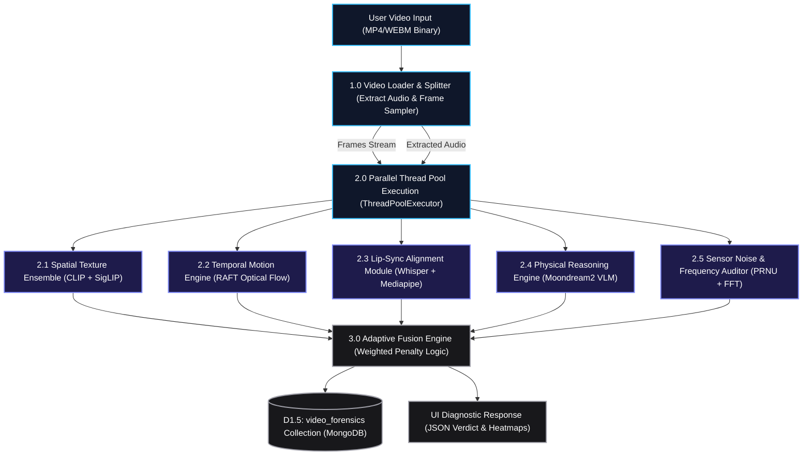

# 📹 FakeShield: AI Video Forensic Lab Architecture & Technical Documentation

This document explains the technical implementation, model pipeline, and processing workflow of the **AI Video Forensic Lab (Process 5.0)** in the FakeShield system.

---

## ⚙️ Video Lab Processing Architecture Diagram

The flowchart below demonstrates the sequential and parallel data flow from the moment a user uploads a video file down to database logging.

---

## 🔬 Core Stages of the Video Forensic Pipeline

### 1. Video Loading & Preprocessing (`video_router.py`)
*   **Frame Sampling**: To guarantee sub-5s processing on standard CPU workloads, the video router limits analysis to **8-16 keyframes** distributed evenly across the video length.
*   **Audio Demuxing**: Uses `ffmpeg` or local sub-processes to isolate the audio track as a WAV file, which is mapped directly to the Lip-Sync module.

---

## 🛰️ Multi-Model Analyzer Specifications

### 🚀 Deep Learning Analyzers (Spatial, Temporal, & Reasoning)

#### A. Spatial Texture Ensemble (`video_clip.py`)
*   **Models**: `openai/clip-vit-base-patch32` (weight: 40%) & `google/siglip-base-patch16-224` (weight: 60%).
*   **Method**: Performs zero-shot classification at the frame level. Contrastive text prompt matrices are mapped to the images:
    *   *Real Prompts*: `"a frame from a real video recorded by a camera"`, `"natural video footage"`.
    *   *AI Prompts*: `"a frame from an AI-generated synthetic video"`, `"synthetic content from Sora/Runway"`.
*   **Aggregator**: Rather than using a mean average (which dilutes localized frame edits like face swaps), it takes the **75th percentile** score.

#### B. Temporal Flow Engine (`video_tempo_raft.py`)
*   **Model**: `torchvision.models.optical_flow.raft_small` (pretrained).
*   **Method**: Computes dense optical flow fields between consecutive frame pairs.
*   **Heuristics**:
    1.  **PAVR (Peak-to-Average Velocity Ratio)**: Detects unnatural temporal morphing spikes.
    2.  **Flow Entropy**: Measures spatial randomness of pixel movements.
    3.  **Temporal Coherence Residual**: Computes the mean difference between consecutive flow vectors.
*   **Artifact Output**: Converts raw optical flow tensors into BGR/RGB **HSV optical flow heatmaps** returned to the React frontend as base64 images.

#### C. Lip-Sync Alignment Module (`video_audio.py`)
*   **Speech Detection**: Uses OpenAI's **Whisper ("base" model)** with greedy search parameters (`beam_size=1`, `best_of=1`) to extract precise word-level speaking timestamps from the audio track.
*   **Lip Motion Tracking**: Uses **Mediapipe Tasks FaceLandmarker** (`face_landmarker.task`) to track lip openness over time by measuring the distance between upper lip indices `[61, 185, 40, ...]` and lower lip indices `[146, 91, 181, ...]` normalized by facial height (landmarks 10 to 152).
*   **Correlation Mismatch**: Checks if lip movement aligns with the speech activity timeline. A high viseme-to-phoneme mismatch rate indicates dubbing or deepfake face synthesis.

#### D. Physical Reasoning Engine (`video_reasoning.py`)
*   **Model**: **Moondream2** (`vikhyatk/moondream2` revision `2024-08-26`).
*   **Method**: Evaluates geometric and physical inconsistencies in target frames (shadow errors, floating pixels, merging features).
*   **Consolidated Forensic Prompt**:
    `"Analyze this frame for AI anomalies (warping, shadows, blurring). Keep response strictly under 15 words. End with exactly 'CONSISTENT' or 'INCONSISTENT'."`
*   **Decision Rule**: Scans the VLM output text for suspicious terms (`warp`, `ghost`, `blur`, `inconsistent`) to calculate the score.

---

### 🎛️ Digital Signal Processing (DSP) Analyzers

#### E. Sensor Noise & Frequency Auditor (`video_forensics_v2.py`)
*   **PRNU Consistency Check**: Photo Response Non-Uniformity (PRNU) acts as a camera sensor fingerprint. The module extracts frame noise residuals using a Gaussian high-pass filter:
    $$\text{Noise} = \text{Frame}_{\text{gray}} - \text{GaussianFilter}(\text{Frame}_{\text{gray}}, \sigma=2.0)$$
    It calculates the cosine correlation coefficient between consecutive frame residuals. Real video shows high cross-correlation due to the shared physical camera sensor. AI-generated video (where frames are generated independently) displays zero correlation.
*   **2D FFT Spectral Decay**: Applies a 2D Fast Fourier Transform (`np.fft.fft2`) on frames, mapping radial average power profiles. GAN/Diffusion generators leave periodic high-frequency checkerboard noise grid signatures, warping the expected $1/f^2$ spectral decay law.

---

## 🧠 The Adaptive Fusion Engine (`video_fusion.py`)

Unlike static classifiers, the Video Fusion Engine dynamically changes model weights based on the video's vertical resolution height ($h$):

### 1. Dynamic Weight Matrix

| Resolution | Spatial (CLIP/SigLIP) | Temporal (RAFT) | Audio (Lip-Sync) | Forensic (PRNU/FFT) | Reasoning (VLM) |
| :--- | :--- | :--- | :--- | :--- | :--- |
| **Low ($<480p$)** | 20% | 20% | 30% | 5% | 25% |
| **Standard ($480p - 720p$)** | 25% | 25% | 20% | 15% | 15% |
| **High ($\ge 1080p$)** | 25% | 30% | 15% | 20% | 10% |

*Rationale:* In low-resolution files, fine sensor noise details (PRNU/FFT) are washed out by compression, so the engine relies heavily on audio lip-sync and VLM reasoning. In high-resolution files, high-frequency spatial and temporal vectors are highly reliable.

### 2. Consistency Penalty
If the spatial score (static texture) and temporal score (flow consistency) disagree significantly ($|\text{Score}_{\text{spatial}} - \text{Score}_{\text{temporal}}| > 0.40$), the engine applies a **+0.10 penalty** to the final probability, reflecting cross-modal morphing instabilities.

### 3. Verdict Mappings
*   $\ge 75\%$: **DEEPFAKE (CRITICAL Threat)**
*   $55\% - 74\%$: **LIKELY FAKE (HIGH Threat)**
*   $35\% - 54\%$: **UNCERTAIN (MEDIUM Threat)**
*   $< 35\%$: **LIKELY REAL (LOW Threat)**
